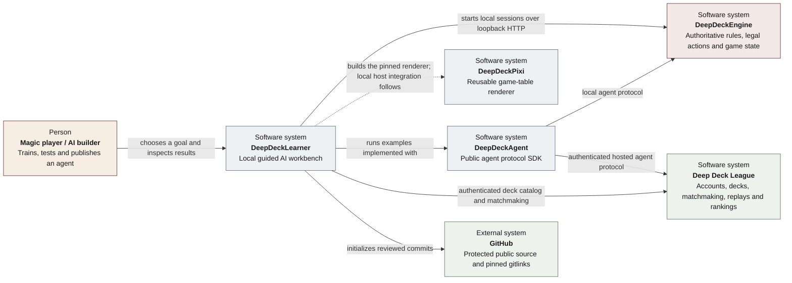
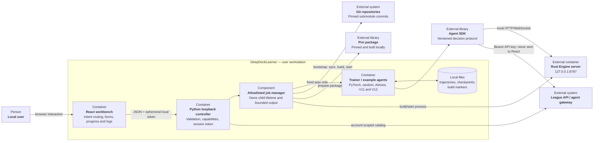

# DeepDeckLearner architecture

Parent epic: [#4](https://github.com/dd-the-dd/DeepDeckLearner/issues/4)

Architecture task: [#13](https://github.com/dd-the-dd/DeepDeckLearner/issues/13)

## C4 level 1 — system context



The dashed Pixi relationship is deliberate: the current workbench retrieves and
builds the public renderer, while the concrete visual session host remains a
separate integration. Preparing Pixi is not presented as starting a second
server.

## C4 level 2 — DeepDeckLearner containers



The browser is presentation-only. It cannot choose a command, repository path,
or revision. The controller derives every path from the project root and every
revision from the current Learner gitlinks.

## Boundaries

```text
React workbench
    | loopback JSON/SSE, session token
Python learner controller
    | allowlisted argv        | versioned SDK protocol
Trainer / example agents      +---------------- Hosted league
    |
DeepDeckEngine local server ---- versioned session ---- DeepDeckPixi client
```

- React owns configuration UX and job presentation.
- The controller owns validation, capability detection, subprocess lifetime,
  redacted metadata, and logs.
- The dependency task module owns fixed submodule synchronization and Pixi build
  stages. It accepts only `engine|pixi` and project-root-derived paths.
- Existing example modules own model inference and dataset training.
- DeepDeckEngine owns rules and state. DeepDeckPixi owns game visualization.
- The hosted league owns accounts, matchmaking, decks, and rankings.

## Repository structure

```text
apps/learner-web/             React + TypeScript workbench
src/deepdeck_learner/         loopback controller and CLI
src/deepdeck_examples/        public V11/V12 and rule-based examples
external/deepdeck-engine/     pinned Git submodule
external/deepdeck-pixi/       pinned Git submodule
external/deepdeck-agent/      pinned Git submodule
docs/                         beginner, ML, and product contracts
```

## Local API v1

- `GET /api/v1/health` - controller readiness.
- `GET /api/v1/status` - capability booleans and dependency revisions.
- `GET /api/v1/jobs` - bounded recent job summaries.
- `POST /api/v1/jobs` - validate and start an allowlisted job.
- `GET /api/v1/jobs/{id}` - job metadata and bounded logs.
- `POST /api/v1/jobs/{id}/stop` - graceful termination request.

The job kinds are `training.smoke`, `training.dataset`, `playtest.agent`,
`matchmaking.agent`, `dependency.stack.prepare`, `dependency.engine.start`,
`dependency.pixi.prepare`, and `dependency.sync`. `training.decks` and
`training.hosted` are returned by status as unsupported until their versioned
capability contracts exist.

## Job execution

The controller creates argv from typed values. It runs without `shell=True`,
inherits only an allowlisted environment, bounds log memory, and records child
process state independently of browser connections. One training job runs at a
time by default to avoid GPU contention; local play can use a separate limit.

## Configuration and secrets

Non-secret defaults may be stored in `.deepdeck/learner.json`. API keys are read
from `DEEPDECK_API_KEY` or a local `.env` ignored by Git. Status reports
`api_key_configured: true|false`, never the key or an environment dump.

The HTTP listener defaults to `127.0.0.1`. Non-loopback binding is rejected by
the first release because the controller can launch local processes.

## Dependency updates

Engine and Pixi submodule commits are the development compatibility lock. CI
checks them recursively. A dependency-update workflow may open a pull request,
run Engine/Pixi/Learner contracts, and require normal branch protection before
merge. Runtime releases should later consume signed/tagged artifacts matching the
same compatibility lock.

The local dependency flow compares each checked-out submodule revision with the
gitlink in the current DeepDeckLearner commit. `dependency.sync` runs fixed
`git submodule sync/update --checkout` arguments and refuses dirty sources.
Pixi preparation runs its locked npm install and official build, then stores the
built revision under ignored `.deepdeck/dependencies/`. Engine starts its fresh
local executable when available and otherwise lets Cargo build before starting.
The Engine process remains a controller-owned long-running job; Pixi is a build
artifact consumed by the visual-client flow, not a second game server.

`dependency.stack.prepare` is the normal entry point. One controller-owned child
first refuses any dirty dependency, initializes/synchronizes only stale gitlinks,
prepares Pixi only when its revision marker is stale, and finally starts Engine
only when its loopback health endpoint is unavailable. Keeping the sequence in
one job makes it resume-visible after a browser refresh and prevents the browser
from racing Engine start against submodule initialization.

## Failure handling

- Missing dependency: the primary setup action initializes it; a failed Git
  operation retains bounded diagnostics and preserves the target directory.
- Dirty dependency: prevent sync and preserve every local file.
- Missing Rust/Node toolchain: fail the bounded setup job with the missing tool.
- Browser disconnect during build/start: the controller retains job ownership.
- Engine unhealthy: retain form state, show endpoint and retry.
- Child failure: mark failed, retain bounded output, expose CLI reproduction.
- Browser disconnect: job continues; reconnection reads controller state.
- Controller stop: child processes receive graceful termination, then a bounded
  forced termination only when necessary.

## Secure listener and credential extension

Non-secret defaults are stored atomically in `.deepdeck/learner.json`. API keys
are read from an explicit `DEEPDECK_API_KEY`, the operating-system credential
vault, or a manually managed local `.env` ignored by Git in that order. Keys
submitted through the UI are written only to the credential vault. Status
reports configured, provider, and external-management metadata, never the key
or an environment dump.

The HTTP listener defaults to `127.0.0.1`. Host Settings may persist an opt-in
`0.0.0.0` LAN listener and port. Requests originating from the host, including
through one of its own LAN addresses, receive an owner session. Other trusted
LAN requests receive a restricted in-memory session directly. Every controller
route except health and session creation requires a session. Only an owner
request originating from the host may mutate keys or network settings. The CLI
owns restart and reloads the persisted listener only after the settings response
completes.

Account-key input travels once from React to the local controller, is verified
against the authenticated competition catalog, and is then cleared. It is never
returned by an API. Restricted LAN sessions can operate allowlisted jobs but cannot
read or replace the key.

The non-secret agent training profile is stored atomically beside network
defaults in `.deepdeck/learner.json`. `GET|PUT /api/v1/training-profile` exposes
only the allowlisted model, format, and named deck-version summaries. The
controller validates format consistency and uniqueness before persistence; the
browser never submits arbitrary paths or commands through this contract.
